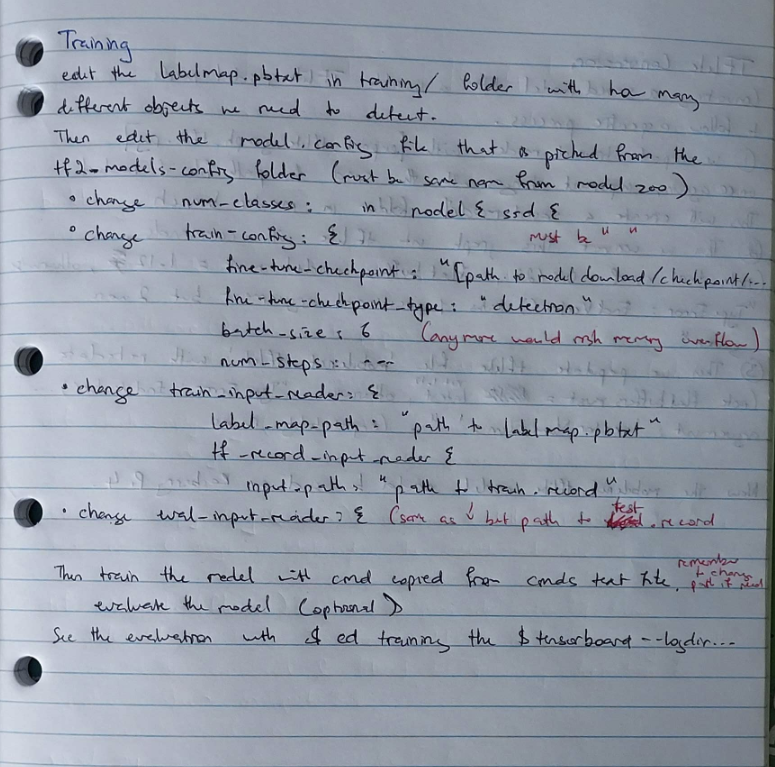
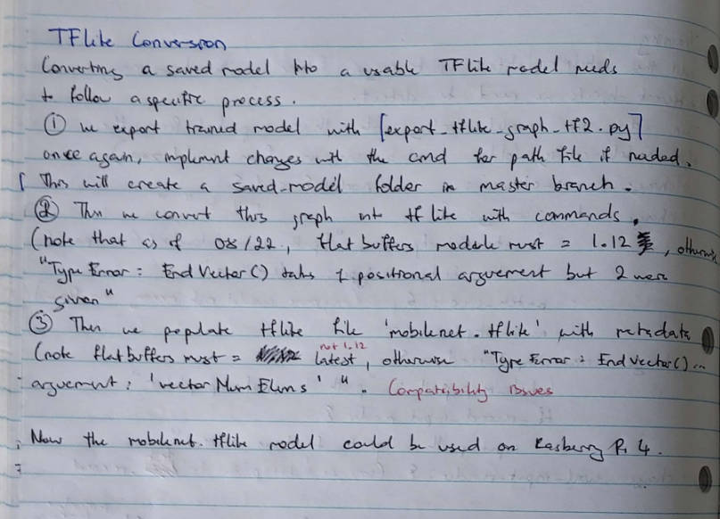

# RaspPi4-MachineLearning
Deploying TF-Lite model on Raspberry Pi 4 

# NOTE
Currently working with buffer1.12 and 1.21 ONLY

Uploading raw materials here for now, will detail a walk-through later. If you would like to know how to train and deploy one right now, contact minhtran072005@gmail.com and we can setup a call

